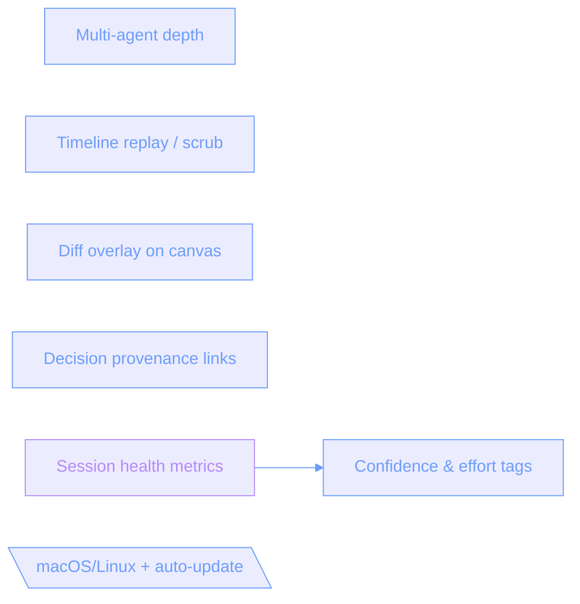

# Nodestorm roadmap  -  post-v0.9 candidates

_Decision record exported from a nodestorm brainstorm on 2026-07-19._

**7 components · 2 decided · 0 dismissed · 0 open**

## Architecture

_Color = status: gray existing · blue proposed · amber modified · purple affected · red dashed removed._

### Components

- **Confidence & effort tags** (component, proposed) — Agent tags nodes/options with certainty and a size; sizes roll up per group into the exported record.
- **Multi-agent depth** (component, proposed) — Per-agent queue editing + edge/choice-level attribution (nodes are attributed today). From the existing 'Next' backlog.
- **Timeline replay / scrub** (component, proposed) — Scrub the session log to see the graph at any past point. The timeline data is already captured.
- **Diff overlay on canvas** (component, proposed) — Render diff_sessions / diff_record as color on the graph itself, not just in a side panel.
- **Decision provenance links** (component, proposed) — Every decided node links to its considered-trail and the moment it was decided, in the exported record.
- **Session health metrics** (component, affected) — Decision velocity, reopened-choice count, open-question age  -  surfaced in the topbar and the exported record.
- **macOS/Linux + auto-update** (external, proposed) — Cross-platform native builds and an in-app updater. Windows / Microsoft Store is already moving (#23).

## Decisions

### What estimate scale for effort? — Confidence & effort tags

**Decision: T-shirt (S/M/L/XL) ★ agent-recommended** — Coarse sizes, honest about imprecision.

- Pros: Fast; No false precision
- Cons (accepted): No arithmetic rollup

Also considered:

- **Fibonacci points** — Numeric points that sum. (pros: Sums cleanly; cons: False precision; Estimation ritual)
- **Confidence % only** — Certainty without an effort axis. (pros: Simplest; cons: Misses the cost half)

_Decided 2026-07-19._

### Packaging and update path? — macOS/Linux + auto-update

**Decision: Per-OS native + in-app updater ★ agent-recommended** — dmg / AppImage / MSIX with a self-update channel.

- Pros: Best UX; Matches MS Store direction
- Cons (accepted): 3 pipelines; Signing certs

Also considered:

- **Manual GitHub releases only** — Tarballs on the releases page. (pros: Cheapest; cons: No auto-update; Install friction)

_Decided 2026-07-19._

## Session log

- 2026-07-19 04:32 — asked to remove “variants”
- 2026-07-19 04:32 — picked “T-shirt (S/M/L/XL)” for Confidence & effort tags
- 2026-07-19 04:34 — asked to remove “artifact-links”
- 2026-07-19 04:34 — asked to remove “tickets-export”
- 2026-07-19 04:34 — asked to remove “repo-seed”
- 2026-07-19 04:34 — asked to remove “multi-human”
- 2026-07-19 04:34 — asked to remove “snapshot-share”
- 2026-07-19 04:34 — asked to remove “comments”
- 2026-07-19 04:35 — asked to remove “drilldown”
- 2026-07-19 04:36 — picked “Per-OS native + in-app updater” for macOS/Linux + auto-update
- 2026-07-19 04:40 — answered “v010-scope”: Pick whatever order is logical

<!-- nodestorm-record v1
{"version":1,"title":"Nodestorm roadmap  -  post-v0.9 candidates","revision":0,"focus":"session-metrics","nodes":[{"id":"confidence-effort","label":"Confidence & effort tags","kind":"component","description":"Agent tags nodes/options with certainty and a size; sizes roll up per group into the exported record.","status":"proposed","group":null,"lane":"v0.10 Insight & records","choices":[{"id":"estimate-scale","prompt":"What estimate scale for effort?","rationale":null,"options":[{"id":"tshirt","label":"T-shirt (S/M/L/XL)","summary":"Coarse sizes, honest about imprecision.","pros":["Fast","No false precision"],"cons":["No arithmetic rollup"],"recommended":true,"affects":["session-metrics"]},{"id":"points","label":"Fibonacci points","summary":"Numeric points that sum.","pros":["Sums cleanly"],"cons":["False precision","Estimation ritual"],"recommended":false,"affects":[]},{"id":"confidence-only","label":"Confidence % only","summary":"Certainty without an effort axis.","pros":["Simplest"],"cons":["Misses the cost half"],"recommended":false,"affects":[]}],"selected":"tshirt","status":"decided"}],"notes":[],"position":null},{"id":"multiagent-depth","label":"Multi-agent depth","kind":"component","description":"Per-agent queue editing + edge/choice-level attribution (nodes are attributed today). From the existing 'Next' backlog.","status":"proposed","group":null,"lane":"v0.11 Loop & timeline","choices":[],"notes":[],"position":null},{"id":"timeline-replay","label":"Timeline replay / scrub","kind":"component","description":"Scrub the session log to see the graph at any past point. The timeline data is already captured.","status":"proposed","group":null,"lane":"v0.11 Loop & timeline","choices":[],"notes":[],"position":null},{"id":"canvas-diff-overlay","label":"Diff overlay on canvas","kind":"component","description":"Render diff_sessions / diff_record as color on the graph itself, not just in a side panel.","status":"proposed","group":null,"lane":"v0.10 Insight & records","choices":[],"notes":[],"position":null},{"id":"provenance","label":"Decision provenance links","kind":"component","description":"Every decided node links to its considered-trail and the moment it was decided, in the exported record.","status":"proposed","group":null,"lane":"v0.10 Insight & records","choices":[],"notes":[],"position":null},{"id":"session-metrics","label":"Session health metrics","kind":"component","description":"Decision velocity, reopened-choice count, open-question age  -  surfaced in the topbar and the exported record.","status":"affected","group":null,"lane":"v0.10 Insight & records","choices":[],"notes":[],"position":null},{"id":"cross-platform","label":"macOS/Linux + auto-update","kind":"external","description":"Cross-platform native builds and an in-app updater. Windows / Microsoft Store is already moving (#23).","status":"proposed","group":null,"lane":"v0.12+ Cross-platform","choices":[{"id":"packaging","prompt":"Packaging and update path?","rationale":null,"options":[{"id":"native-updater","label":"Per-OS native + in-app updater","summary":"dmg / AppImage / MSIX with a self-update channel.","pros":["Best UX","Matches MS Store direction"],"cons":["3 pipelines","Signing certs"],"recommended":true,"affects":[]},{"id":"manual-release","label":"Manual GitHub releases only","summary":"Tarballs on the releases page.","pros":["Cheapest"],"cons":["No auto-update","Install friction"],"recommended":false,"affects":[]}],"selected":"native-updater","status":"decided"}],"notes":[],"position":null}],"edges":[{"from":"session-metrics","to":"confidence-effort","kind":"depends_on","label":null,"status":"proposed"}]}
-->
