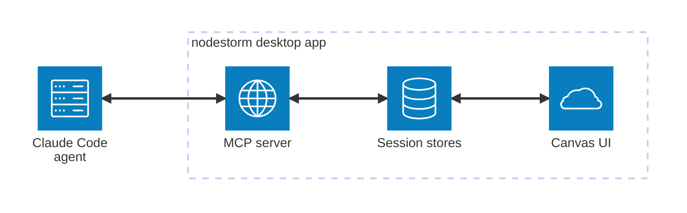

# Demo video + mermaid architecture diagram — design

**Date:** 2026-07-17
**Status:** approved in-session (segment GIFs + full MP4; ffmpeg via winget)

## Goals

1. A paced, subtitled demo of all nodestorm functionality, stored in the
   repo under `docs/demo/` and embedded in README.md.
2. Replace the README's ASCII architecture diagram with a mermaid
   `architecture-beta` diagram GitHub renders natively.

## Hard constraints

- **GitHub embedding reality:** READMEs never inline-play repo-committed
  video files. Therefore: one animated GIF per demo segment embedded in the
  matching README section (GIFs play inline everywhere), plus the full
  continuous MP4 committed at `docs/demo/nodestorm-demo.mp4` and linked
  behind a poster image for click-to-view quality. An `.srt` sidecar ships
  next to the MP4.
- **Machine in active human use:** window-scoped automation only. All
  recording is `PrintWindow PW_RENDERFULLCONTENT` frame capture of the app
  window (works occluded, at bottom z-order); driving is UIA + posted
  window-targeted messages, exactly like `scripts/verify-windows.ps1`. No
  screen recorders, no foreground stealing, no global input, ever.
- **WebView2 occluded-resize freeze** (docs/webview2-occluded-resize.md):
  never resize the window mid-segment while occluded. Segments needing a
  different window size get a fresh app launch at that size (first layout
  is always correct).
- **ffmpeg via winget** (user-approved system install):
  `winget install --id Gyan.FFmpeg -e --accept-source-agreements
  --accept-package-agreements`; invoke `ffmpeg` from PATH afterwards (new
  shells see it; use the winget links path explicitly if the current shell
  does not).
- Recording uses scratch session/prefs dirs and a non-default port; the
  user's real data and port 4747 are untouched.

## Components

### 1. `scripts/uia-lib.ps1` (extracted shared library)

The `Add-Type` native block (SetWindowPos, GetWindowRect, GetClassName,
PrintWindow, PostMessageW, EnumWindows…) and the helper functions
(`Find-Element`, `Wait-Element`, `Wait-ElementGone`, `Get-RenderWidget`,
`Click-Element`, `Click-Point`, `Save-WindowPng`, `Get-AppWindow`,
`Wait-Tcp`, window-targeted typing) move verbatim from
`verify-windows.ps1` into a dot-sourceable `scripts/uia-lib.ps1`.
`verify-windows.ps1` dot-sources it; behavior byte-identical. **Gate: the
full E2E must pass after the refactor, before any demo work builds on
it.**

### 2. `examples/demo_agent.rs` (scripted agent)

A purpose-built MCP client (modeled on `examples/drive.rs`) that performs
the demo's agent side against `http://127.0.0.1:<port>/mcp`:
- proposes a notes-app architecture graph (~10 nodes) **with at least one
  named group** (needed for the collapse segment) and two open choices
  with pros/cons + ★ recommendation and `affects` lists (ripple demo);
- blocks in `await_decisions`; on delivery, applies a small
  `update_graph` reaction (marks nodes modified/affected, resolves the
  choices) so the demo shows the round trip;
- tolerates timeout-and-recall like drive.rs.

### 2b. `--window-size WxH` CLI flag (tiny, additive)

The window is hardcoded to 1280×840 (`src/ui/mod.rs` launch). A new
optional `--window-size 760x840` flag overrides `with_inner_size`
(logical px). This is how per-segment launch sizes work — never
post-launch resizes, which the occluded-resize freeze makes untrustworthy
beyond the first. Flag is additive; default behavior unchanged; README
CLI table gains a row.

### 3. `scripts/record-demo.ps1` (driver + recorder)

Per segment: launch app (fresh scratch dirs, port 4799, fixed logical
size), push to HWND_BOTTOM, run the segment's action list, capture frames
at 10fps from a background runspace (PrintWindow → PNG in a temp frames
dir), and append caption entries `{start_s, end_s, text}` to the
segment's `captions.json` as actions execute. Pacing rules: dwell 1.5–3s
after each visual payoff; no caption shorter than 2.5s; captions describe
what is happening ("The agent proposes an architecture — every card is a
component, every edge a dependency").

Segments (fresh launch where size differs; theme = default dark unless
stated):

| # | File | Size | Content | ~len |
|---|------|------|---------|------|
| 1 | 01-propose.gif | 1160×800 | empty state → demo_agent proposes → cards/edges/rails appear, waiting chip pulses | 12s |
| 2 | 02-decide.gif | same app | select card → panel: pros/cons, ★ — hover option → ripple glow — pick both choices, type message, Send ϟ; agent reacts (status flips, choices resolve) | 18s |
| 3 | 03-edit.gif | same app | + node pod → rename via panel form → Connect → click target → delete an agent node (removal_requested) → undo via the ↶ pod (posted messages can't hold Ctrl, and the pod is the visible affordance anyway) | 15s |
| 4 | 04-navigate.gif | same app | search "notes", Enter zoom-cycle → minimap drag-pan → collapse the group to a cluster card → expand | 12s |
| 5 | 05-sessions.gif | same app | session menu: create "experiment", switch, switch back, Compare panel → Timeline panel | 15s |
| 6 | 06-export.gif | same app | ⋯ More → Export ▾ → Export; activity receipt; caption explains the Markdown decision record | 8s |
| 7 | 07-themes.gif | same app | ⋯ More → Theme ▾ → Light → Gruvbox → Catppuccin (menu stays open for modes, closes on family) | 10s |
| 8 | 08-responsive.gif | fresh at 760×840, then fresh at 520×840 | narrow bar: compose pod ✎ popover with typed message; then 520: ⋯ More shows folded ↶ Undo/↷ Redo | 10s |

### 4. Assembly (ffmpeg)

Per segment: frames → `palettegen`/`paletteuse` GIF at 800px wide, 10fps,
`-loop 0`, captions burned via `drawtext` (fontfile
`C:\Windows\Fonts\segoeui.ttf`, semi-opaque black band at the bottom,
`enable='between(t,start,end)'` per caption from captions.json). Budget:
≤4 MB per GIF; if over, drop to 8fps then 720px, in that order.
Full MP4: concat all subtitled segment streams → H.264 yuv420p
`docs/demo/nodestorm-demo.mp4` (+ generated `nodestorm-demo.srt` from the
merged caption timelines; poster frame `docs/demo/poster.png` = a
handsome frame from segment 2).

### 5. README changes

- Top, after the intro paragraph: poster image linking to the MP4 file
  (`[](docs/demo/nodestorm-demo.mp4)`) with
  a one-line caption ("full 100-second tour — GIF highlights below").
- Each segment GIF embedded in the matching existing section (How it
  works, Edit the graph yourself, big-graphs paragraph, Sessions,
  Timeline/Export, Theming, and the narrow-window/responsive mention).
- **ASCII diagram (lines 18–26) replaced** with:

````

````

  followed by the one-line legend: *"`propose_graph` / `update_graph`
  flow left→right; `await_decisions` blocks until your decisions flow
  back with **Send ϟ** (loopback HTTP on 127.0.0.1:4747)."* The existing
  bullet list below the old diagram already carries the per-tool
  semantics and stays. Note: `architecture-beta` edges cannot carry text
  labels, hence the legend line; icons limited to the built-in set
  (server/internet/database/cloud/disk). Rendering is verified on the PR's
  rendered README before merge; fallback if GitHub's mermaid chokes:
  `flowchart LR` equivalent (same nodes/legend).

## Non-goals / out of scope

- No committed ffmpeg binaries; no GIF/MP4 regeneration in CI; no changes
  to app code except `examples/demo_agent.rs` and the `--window-size`
  flag (both additive).
- No re-recording machinery beyond the script being rerunnable end-to-end.

## Testing / acceptance

- Full E2E green after the uia-lib extraction (refactor gate) and again at
  the end.
- `cargo fmt` / `clippy -D warnings` / `cargo test` green (demo_agent
  compiles under `--examples`).
- Every GIF ≤4 MB, plays looped, captions legible at 800px; MP4 + SRT
  present; total `docs/demo/` budget ≤ 35 MB.
- README renders: GIFs inline, mermaid diagram renders on the PR preview,
  no broken links (`git ls-files` check for every referenced path).
- Etiquette audit: recording script contains no SendInput /
  SetForegroundWindow / full-screen capture calls.
